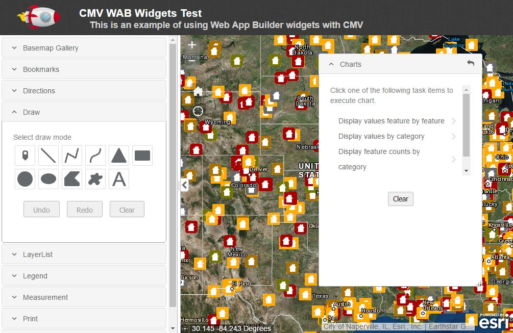
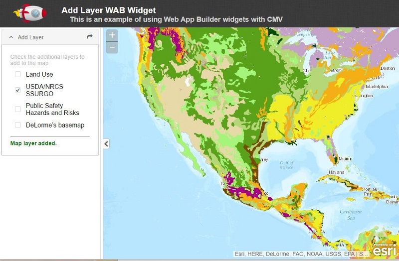
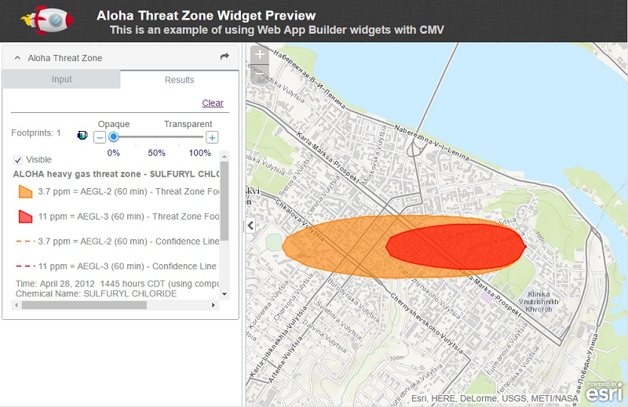
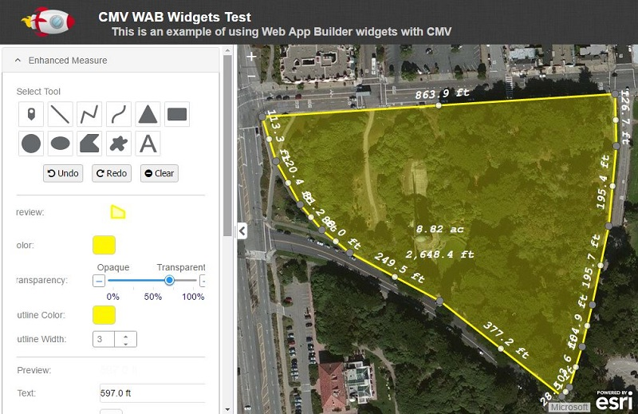
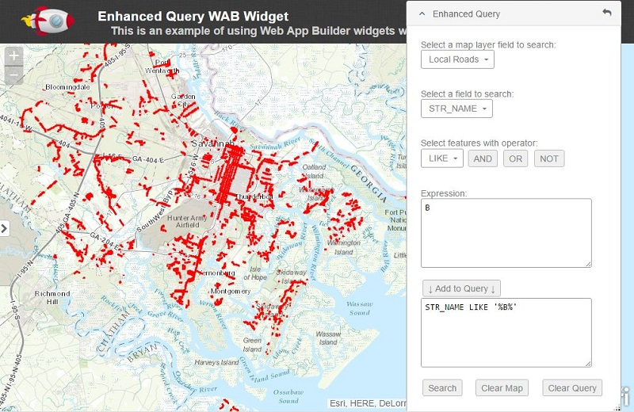
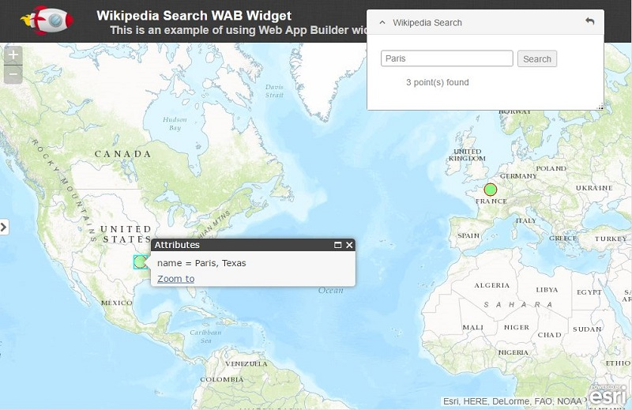

# cmv-wab-widgets

[](https://codeclimate.com/github/cmv/cmv-wab-widgets) [](https://gitter.im/cmv/cmv-wab-widgets?utm_source=badge&utm_medium=badge&utm_campaign=pr-badge&utm_content=badge)

Using widgets from the Esri WebApp Builder in [CMV](https://github.com/cmv/cmv-app).


## Introduction
***This is a work-in-progress.***

Widgets created for the Esri WebApp Builder are very similar to widgets used by CMV. The primary difference between them is WAB widgets rely on the jimu.js library provided by Esri. Since both WAB and CMV widgets are based on the dojo toolkit, any WAB widget could be converted to a CMV widget removing the dependency on jimu.js. That conversion process can be simple or very involved depeding on the complexity of the widget. This repo provides a solution where no conversion is required and WAB widgets can be used directly in CMV without modification.

Another important difference between WAB and CMV is applications developed with the Esri WebApp Builder are dependent on Esri web apps hosted at ArcGIS On-line or within your own implementation of Portal for ArcGIS Server. Both ArcGis Online and Portal require subscriptions at an additional cost. No subscription is required to use the WAB widgets within CMV. Applications developed with CMV use the REST services provided by ArcGIS Server to access AGS resources.


## Notes
A couple of the custom WAB widgets included in this repo were modified. None of those changes were required for the widget to work with CMV. The changes were for a specific need or to overcome poor code practices in the widget like missing dojo dependencies for the widget's template.


## Examples
### Out-of-the-box WAB Widgets

- [Demo](https://cmv.github.io/cmv-wab-widgets/demo.html?config=wab)

### Includes the following widgets:
- Basemap Gallery
- Bookmarks
- Coordinate
- Chart
- Directions
- Draw
- HomeButton
- LayerList
- Legend
- Measurement
- MyLocation
- Print
- Query




### Custom `AddLayer` Widget

- [Config file](https://github.com/cmv/cmv-wab-widgets/blob/master/config/wab-addlayer.js)
- [Demo](https://cmv.github.io/cmv-wab-widgets/demo.html?config=wab-addlayer)
- [Original Widget Source](https://github.com/softwhere/AddLayer-Widget)




### Custom `Aloha Threat Zone` Widget

- [Config file](https://github.com/cmv/cmv-wab-widgets/blob/master/config/wab-alohathreatzone.js)
- [Demo](https://cmv.github.io/cmv-wab-widgets/demo.html?config=wab-alohathreatzone)
- [Original Widget Source](https://geonet.esri.com/docs/DOC-7733)




### Custom `Draw & Measure` and `SaveSession` Widgets
Both of these widgets have been modified from the original to provide additional functionality

- [Config file](https://github.com/cmv/cmv-wab-widgets/blob/master/config/wab-measure.js)
- [Demo](https://cmv.github.io/cmv-wab-widgets/demo.html?config=wab-measure)
- [Original Measure Widget Source](https://geonet.esri.com/docs/DOC-3209)
- [Original SaveSession Source](https://github.com/softwhere/SaveSession-Widget)




### Custom `Enhanced Bookmarks` Widget
- [Config file](https://github.com/cmv/cmv-wab-widgets/blob/master/config/wab-ebookmarks.js)
- [Demo](https://cmv.github.io/cmv-wab-widgets/demo.html?config=wab-ebookmarks)
- [Original Widget Source](https://geonet.esri.com/docs/DOC-6889)


### Custom `Enhanced Query` Widget
- [Config file](https://github.com/cmv/cmv-wab-widgets/blob/master/config/wab-enhancedquery.js)
- [Demo](https://cmv.github.io/cmv-wab-widgets/demo.html?config=wab-enhancedquery)
- [Original Widget Source](https://github.com/kevinsagis/EnhancedQuery)




### Custom `Wikipedia Search` Widget
- [Config file](https://github.com/cmv/cmv-wab-widgets/blob/master/config/wab-wikipediasearch.js)
- [Demo](https://cmv.github.io/cmv-wab-widgets/demo.html?config=wab-wikipediasearch)
- [Original Widget Source](https://github.com/kevinsagis/EnhancedQuery)




## Requirements
- This method uses the version 2.0.0-beta.1 of cmv currently in the [develop branch](https://github.com/cmv/cmv-app/tree/develop).
- This method supports version 2.3 of the WebApp Builder released in January 2017 as well as version 2.2 released in October 2016.
- The app in this repo use a new [dojo flat theme](https://github.com/dojo/themes) which is planned for release with dojo 1.12. This replaces the old dbootstrap theme which is no longer being maintained. This is optional.


## Changes to your CMV application
Currently, the process requires 3 simple changes to your CMV application. I anticipate these changes will be incorporated into the main cmv-app project and so most of these steps will be eliminated and it will be a simple configuration exercise to use WAB widgets in CMV.

1. Add the new [_WABMixin.js](https://github.com/cmv/cmv-wab-widgets/blob/master/config/_WABMixin.js) controller mixin to your app. I placed mine in the config folder.

2. Modification to [app.js](https://github.com/cmv/cmv-wab-widgets/blob/master/config/app.js):

    - Add packages for jimu, lib and widgets folders from WAB to dojoConfig:
        ``` javascript
        /* customizations for WAB widgets */
        },{
            name: 'jimu',
            location: path + 'wab/2.3/jimu.js'
        },{
            name: 'libs',
            location: path + 'wab/2.3/libs'
        },{
            name: 'wabwidgets',
            location: path + 'wab/2.3/widgets'
        /* end customizations for WAB widgets */
        ```

    - Add the new mixin to the Controller:
        ``` javascript
        require(window.dojoConfig, [
            'dojo/_base/declare',

            // minimal Base Controller
            'viewer/_ControllerBase',

            // *** Controller Mixins
            // Use the core mixins, add custom mixins
            // or replace core mixins with your own
            'viewer/_ConfigMixin', // manage the Configuration
            'viewer/_LayoutMixin', // build and manage the Page Layout and User Interface
            'viewer/_MapMixin', // build and manage the Map
            'viewer/_WidgetsMixin', // build and manage the Widgets

            'config/_WABMixin' // cusom mix-in to use WAB widgets

        ], function (
            declare,

            _ControllerBase,
            _ConfigMixin,
            _LayoutMixin,
            _MapMixin,
            _WidgetsMixin,

            _WABMixin

        ) {
            var controller = new (declare([
                _ControllerBase,
                _ConfigMixin,
                _LayoutMixin,
                _MapMixin,
                _WidgetsMixin,
                _WABMixin
            ]))();
            controller.startup();
        });
        ```

3. Modifications to the [html](https://github.com/cmv/cmv-wab-widgets/blob/master/demo.html):

    - Add the jimu-theme.css stylesheet:
        ``` html
        <link rel="stylesheet" type="text/css" href="./wab/2.3/jimu.js/css/jimu-theme.css">
        ```

    - Add an id to the main.css stylesheet:
        ``` html
        <link id="theme_cmv_style_common" rel="stylesheet" type="text/css" href="./cmv/css/main.css">
        ```
        All widget-specific stylesheets will be loaded above this stylesheet in the HEAD.

    - Add stylesheets to help the CMV and JIMU themes co-exist:
        ``` html
        <!-- some css tweaks for WAB widgets (optional) -->
        <link rel="stylesheet" type="text/css" href="./css/cmv-wab.css">
        ```

    - Some WAB widgets require another lib added globally:
        ``` html
        <!-- needed by some wab widgets like Print -->
        <script src="./wab/2.3/libs/caja-html-sanitizer-minified.js"></script>
        ```

## Adding WAB widgets to your cmv configuration
Adding WAB widgets to your CMV application is very similar to adding CMV widgets. Below are several examples with comments to identify the differences needed for WAB widgets.

### Examples of 'off-panel` widgets included with WAB:

**Coordinate Widget**

``` javascript
coordinate: {
    include: true,
    id: 'coordinate',
    type: 'domNode',
    srcNodeRef: 'mapInfoDijit',
    path: 'jimu/BaseWidgetPanel',
    options: {
        widgetManager: true,
        config: {
            widgets: [
                {
                    id: 'WABCoordinate',
                    uri: 'wabwidgets/Coordinate/Widget' // Note the path
                }
            ]
        }
    }
},
```

**HomeButton and MyLocation Widgets**

``` javascript
mapButtons: {
    include: true,
    id: 'mapButtons',
    type: 'domNode',
    srcNodeRef: 'homeButton',
    path: 'jimu/BaseWidgetPanel', // Note the path
    options: {
        // use the WAB WidgetManager (required)
        widgetManager: true,

        // configuration for the BaseWidgetPanel
        config: {
            // a BaseWidgetPanel can contain multiple widgets
            widgets: [
                {
                    id: 'WABHome',
                    uri: 'wabwidgets/HomeButton/Widget' // Note the path
                },
                {
                    id: 'WABMyLocation',
                    uri: 'wabwidgets/MyLocation/Widget'  // Note the path
                }
            ]
        }
    }
},
```

### Examples of 'in-panel` widgets included with WAB:

**Draw Widget**
``` javascript
draw: {
    include: true,
    id: 'draw',
    type: 'titlePane',
    position: 3,
    title: 'Draw',
    open: false,
    path: 'jimu/BaseWidgetPanel', // Note the path
    options: {
        // use the WAB WidgetManager (required)
        widgetManager: true,

        config: {
            widgets: [
                // minimum configuration for the WAB Widget
                {
                    id: 'WABDraw',
                    uri: 'wabwidgets/Draw/Widget' // Note the path
                }
            ]
        }
    }
}
```

**Query Widget**

``` javascript
query: {
    include: true,
    id: 'query',
    type: 'titlePane',
    position: 8,
    title: 'Query',
    open: false,
    path: 'jimu/BaseWidgetPanel', // Note the path
    options: {
        // use the WAB WidgetManager (required)
        widgetManager: true,

        config: {
            widgets: [
                {
                    id: 'WABQuery',
                    uri: 'wabwidgets/Query/Widget', // Note the path

                    // more complex configuration passed to WAB Widget
                    config: {
                        queries: [
                            {
                                name: 'Cities',
                                url: 'https://sampleserver6.arcgisonline.com/arcgis/rest/services/SampleWorldCities/MapServer/0',
                                filter: {
                                    logicalOperator: 'AND',
                                    parts: [
                                        {
                                            fieldObj: {
                                                name: 'POP_RANK',
                                                label: 'POP_RANK',
                                                shortType: 'number',
                                                type: 'esriFieldTypeInteger'
                                            },
                                            operator: 'numberOperatorIs',
                                            valueObj: {
                                                isValid: true,
                                                type: 'value',
                                                value: 3
                                            },
                                            interactiveObj: '',
                                            caseSensitive: false,
                                            expr: 'POP_RANK = 3'
                                        }
                                    ],
                                    expr: 'POP_RANK = 3'
                                },
                                popup: {
                                    title: '${CITY_NAME}',
                                    fields: [
                                        {
                                            name: 'CITY_NAME',
                                            alias: 'CITY_NAME',
                                            specialType: 'none'
                                        }
                                    ]
                                },
                                resultsSymbol: {
                                    color: [
                                        0,
                                        0,
                                        128,
                                        128
                                    ],
                                    size: 18,
                                    angle: 0,
                                    xoffset: 0,
                                    yoffset: 0,
                                    type: 'esriSMS',
                                    style: 'esriSMSCircle',
                                    outline: {
                                        color: [
                                            0,
                                            0,
                                            128,
                                            255
                                        ],
                                        width: 0.75,
                                        type: 'esriSLS',
                                        style: 'esriSLSSolid'
                                    }
                                },
                                objectIdField: 'OBJECTID',
                                orderByFields: []
                            }
                        ]
                    }
                }
            ]
        }
    }
}
```

### Examples of 'in-panel` custom widget:

[**Aloha Threat Zone Widget**](https://geonet.esri.com/docs/DOC-7733)

``` javascript
widget: {
    include: true,
    id: 'widget',
    type: 'titlePane',
    position: 0,
    title: 'Aloha Threat Zone',
    canFloat: true,
    resizable: true, // This widget is resizable when floating
    open: true,
    path: 'jimu/BaseWidgetPanel', // Note the path
    options: {
        // use the WAB WidgetManager (required)
        widgetManager: true,

        // This widget requires some height to work properly
        style: 'height:400px;',

        config: {
            widgets: [
                {
                    id: 'WABWidget',
                    uri: 'widgets/AlohaThreatZone/Widget'  // Note the path
                }
            ]
        }
    }
}
```

[**SaveSession Widget**](https://github.com/softwhere/SaveSession-Widget)

``` javascript
saveSession: {
    include: true,
    id: 'saveSession',
    type: 'titlePane',
    position: 0,
    title: 'Save Session',
    open: true,
    path: 'jimu/BaseWidgetPanel', // Note the path
    options: {
        // use the WAB WidgetManager (required)
        widgetManager: true,

        config: {
            widgets: [
                {
                    id: 'WABSaveSession',
                    uri: 'widgets/SaveSession/Widget',  // Note the path
                    // includes an optional configuration
                    config: {
                       fileNameForAllSessions: "cmvSessions.json",
                       fileNameTplForSession: "cmvSessions_${name}.json"
                    }
                }
            ]
        }
    }
}
```

## To-Do
At least 2 areas still need some work:

- A few widgets (like Bookmarks) might need some additional css tweaks to style properly.
- Currently, `off-panel` Widgets are loaded within a `BaseWidgetPanel`. This is probably unnecessary.


##Sources of WAB Widgets
You can find WAB widgets:
- [Widgets included with WAB](https://developers.arcgis.com/web-appbuilder/api-reference/about.htm)
- [Custom WAB Widgets](http://gavinr.github.io/wab-widget-search/)
- [This repo](https://github.com/USEPA/Public_Web_AppBuilder/tree/master/widgets/) from the U.S. EPA has many of the included and custom widgets all in one place. This repo is not up-to-date with WAB 2.0 widgets.

## License

[MIT](https://raw.githubusercontent.com/cmv/cmv-wab-widgets/master/LICENSE.md)
